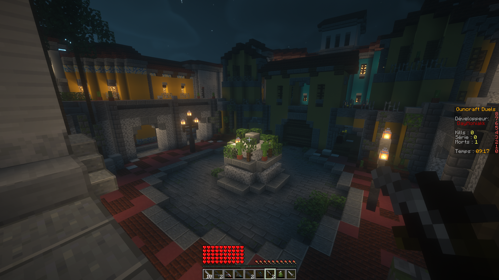
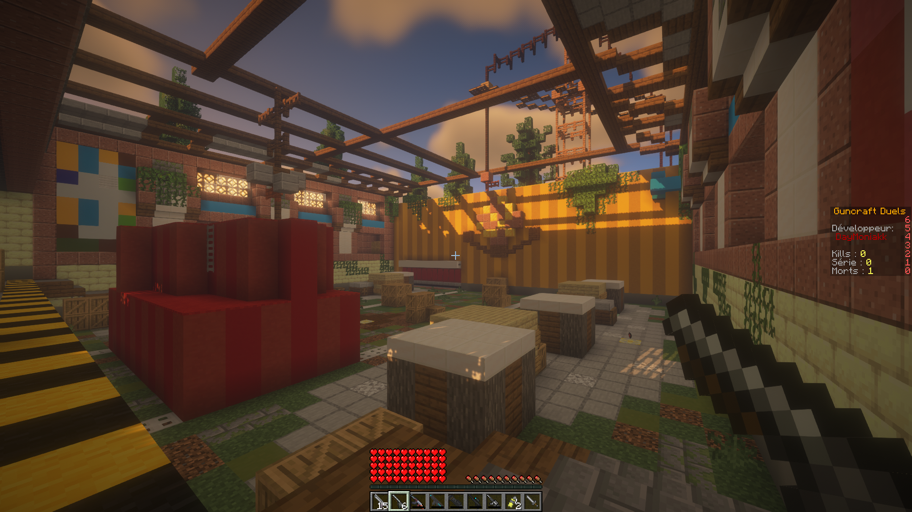
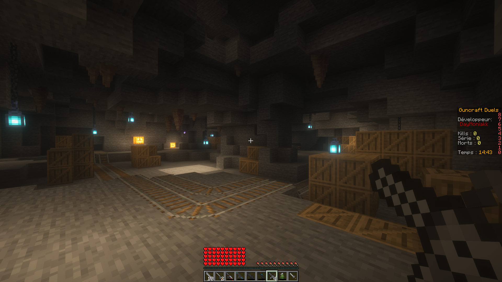
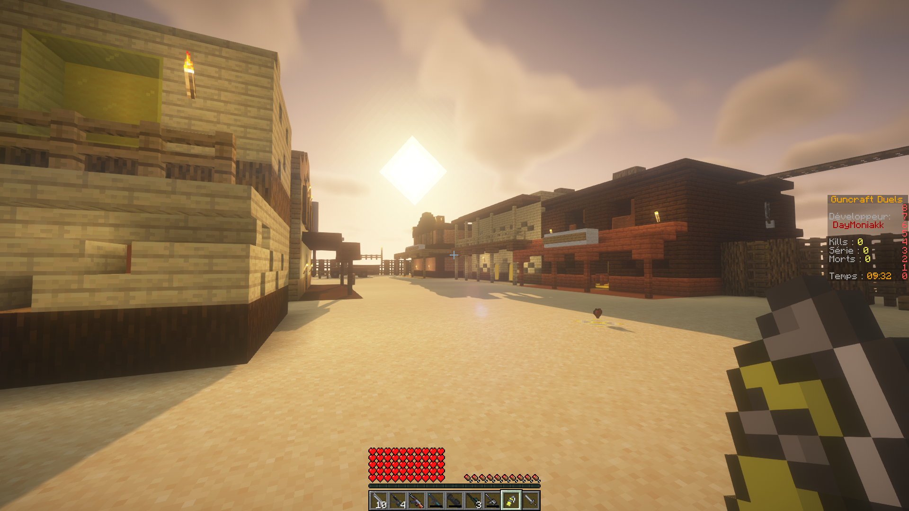

#  Guncraft Duels

Guncraft duels est une version miniaturisée du remake du Guncraft sortie en 2021 par DayMoniakk & Nosfear (fermé le 30 Octobre 2022).
\
Ce mini-jeu à été entièrement refait de A à Z (hormis le code des armes ayant été ré-utilisé)
\
\
Le but de cette version est de vous offrir la possibilité de jouer entre amis sans prise de tête.

</img> 
</img> 
</img> 
</img>

[**> Téléchargement <**](https://github.com/DayMoniakk/Guncraft-Duels/releases)
\
\
[*Tutoriel vidéo*](https://www.youtube.com/watch?v=3MxCa1BJb_g)

# Les différences

### Fonctionnalités ajoutées
* nouveaux kits
* nouvelles maps
* modificateurs de jeu optionnels
* les joueurs morts lâchent de la santé
* les points de vie restants de l'adversaire sont affichés dans le message de mort

### Fonctionnalités modifiées
* le sniper n'est plus nerf
* les armes apparaissent toutes les 30s au lieu de 60s
* rééquilibrage des kits existants
* le cooldown des items spéciaux tels que le medkit, ghost, etc... à été réduit de moitié

### Fonctionnalités supprimées
* pas de missions
* pas d'anticheat
* pas de mode de jeu en équipe
* les vitres ne sont plus cassables

# Comment jouer
Vous avez deux options :
* Lancer le serveur sur votre ordinateur
* Utiliser un hébergeur dédié

## Héberger localement
Pour lancer le serveur ouvrez le fichier `run.bat`.
\
*Vous pouvez modifier la ram allouée pour le serveur dans ce même fichier, 
par défaut c'est réglé sur 1 GO de ram, ce qui est amplement suffisant pour quelques joueurs.*
\
\
**Si vous avez un message d'erreur en ouvrant le serveur vous devez installer le [**JDK 17**](https://www.oracle.com/java/technologies/javase/jdk17-archive-downloads.html).**

### Jouer avec ses amis
Pour laisser des personnes vous rejoindre il faudra soit ouvrir les ports de votre box internet 
ou alors utiliser un logiciel tel que [Hamachi](https://vpn.net/).
\
\
Prenons Hamachi comme exemple, cliquez sur *Network* puis *Create a network*.
\
Entrez le nom et le mot de passe de votre choix et demander à vos amis de rejoindre via
*Network* puis *Join an existing network*.
\
\
Ensuite ouvrez le fichier *server.properties* avec un éditeur de texte, repérez la ligne *server-ip=*
et copiez collez l'adresse IP se trouvant dans Hamachi au dessus de votre Pseudo (clic droit/*copy IPv4 address*)
\
\
Une fois que c'est fait vous et vos amis pourront vous connecter au serveur en utilisant cette même adresse IPv4.

## Utiliser un hébergeur dédié
Je ne vais pas aller en détail sur le sujet, je vous laisse donc trouver un tutoriel sur internet.
Notez simplement que les fichiers `plugins` et `world`, ainsi que leur contenu sont obligatoires au fonctionnement du jeu !

# FAQ
### Pourquoi les anciennes maps ne sont pas dedans ?
Tout simplement car elles sont trop grandes, comme nous l'avons vu précémment ce n'est pas très fun
de tout le temps chercher où est son adversaire quand il y a peu de joueurs.
### Puis-je rajouter des maps ?
Non, il est difficile d'implémenter cette fonctionnalité de manière simple à comprendre pour tout le monde.
### Combien de joueurs sont supportés par le jeu ?
"Techniquement" vous pouvez jouer avec autant de joueurs que vous le souhaitez, **MAIS** un nombre important de joueurs risque d'entraîner des lags serveur. Egalement certaines maps seront trop petites pour jouer en grand nombre.
### Comment faire pour que mes amis non-premium puissent rejoindre ?
Une fois le serveur éteint rendez vous dans le fichier `server.properties`, repérez la ligne `online-mode=true` et remplacez la par `online-mode=false`.
\
Attention malgré tout, n'importe quel joueur peut utiliser le pseudo de quelqu'un d'autre.
### Est ce que le plugin peut être mis à jour pour la version 1.XX ?
Ce n'est pas prévu, cependant je pourrais le considérer en cas de forte demande.
### Pourrais-je voir le code source ?
Malheureusement non, si je rends le code source public certains risquent de l'utiliser
à des fins commerciales et je ne suis pas d'accord avec le fait de faire de l'argent sur mon dos.
### J'ai encore une question !
Je vous invite à vous rendre sur le [serveur Discord](https://discord.gg/PsQHTcPgGX).

# License
Vous êtes libre d'utiliser ce produit comme bon vous le semble tant que vous répondez aux exigences ci-dessous:
* Utilisation commerciale strictement interdite
* Interdiction de partager/reupload sans mon accord préalable
